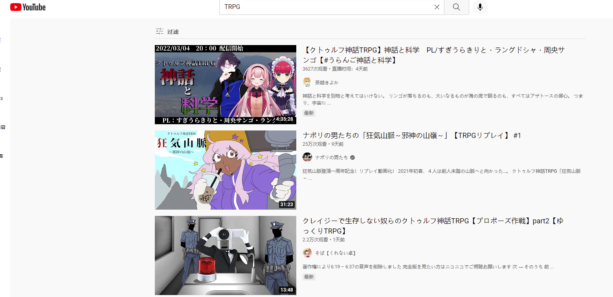
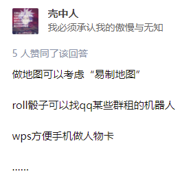
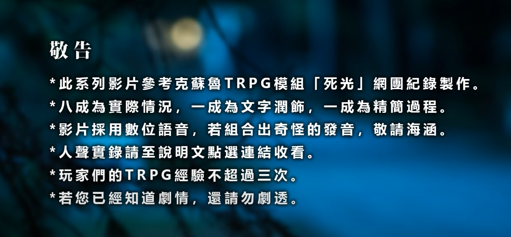
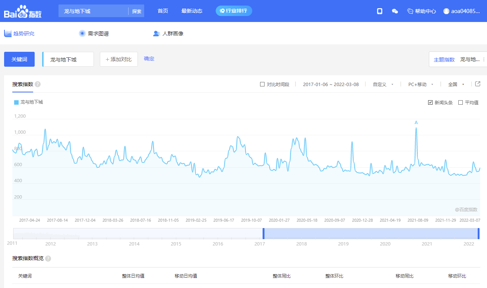
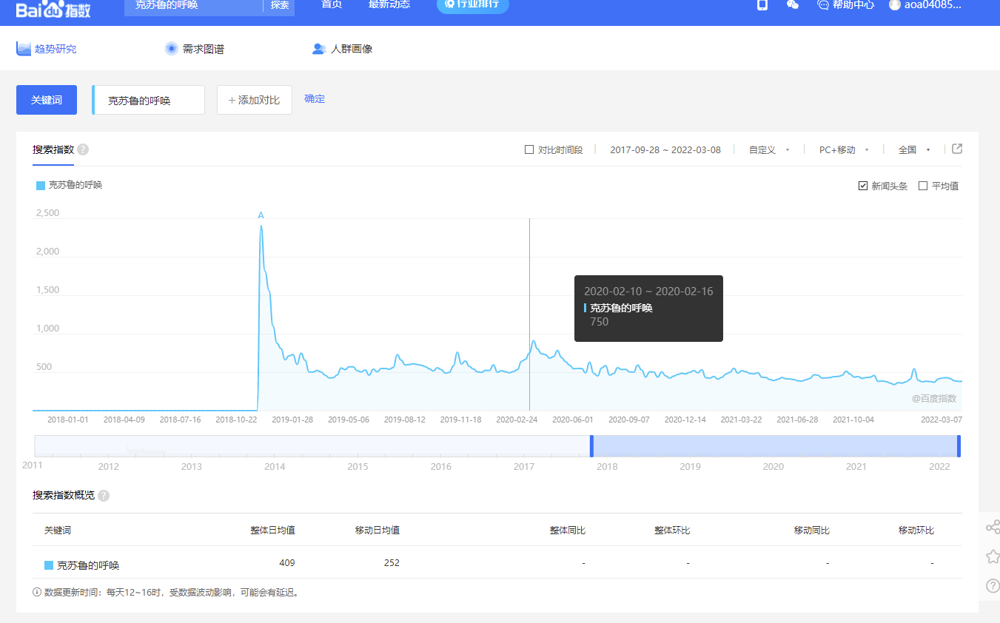
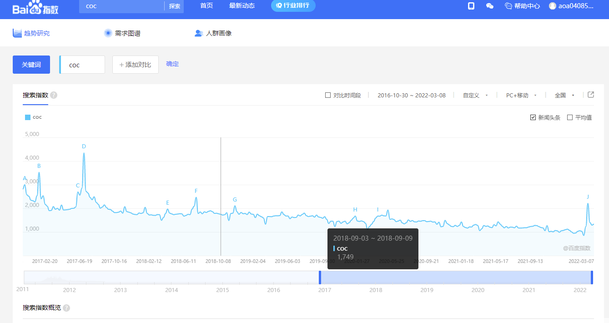

# TRPG 市场研究

什么是跑团？

* [跑团\_百度百科 (baidu.com)](https://baike.baidu.com/item/%E8%B7%91%E5%9B%A2/9451312?fr=aladdin)
* [桌上角色扮演游戏 - 维基百科，自由的百科全书 (wikipedia.org)](https://zh.wikipedia.org/wiki/%E6%A1%8C%E4%B8%8A%E8%A7%92%E8%89%B2%E6%89%AE%E6%BC%94%E9%81%8A%E6%88%B2)

## 行业观察

> B站跑团频道

* 超过5W个视频
* 累计观看3.7亿次
* 有3.2万订阅
* 精品视频300个

> 贴吧

* [克苏鲁跑团吧-百度贴吧--欢迎所有喜欢克苏鲁跑团（COC）的朋友！--克苏鲁神话是国外一部神话小说，讲述一个个远古邪神的故事。而克苏鲁跑团游戏也基于这部神话小说的基础上，以恐怖的邪神为故事背景，玩家作为最 (baidu.com)](https://tieba.baidu.com/f?kw=%E5%85%8B%E8%8B%8F%E9%B2%81%E8%B7%91%E5%9B%A2\&ie=utf-8)
* [跑团吧-百度贴吧--跑团众聚居地 (baidu.com)](https://tieba.baidu.com/f?kw=%E8%B7%91%E5%9B%A2\&ie=utf-8)

> 机核

> youtube 持续有内容产出

## 行业现状

1. DM用爱发电
   * 有DM发帖希望有偿带团，但是玩家并不买账 [有偿带团相关。【跑团吧】\_百度贴吧 (baidu.com)](https://tieba.baidu.com/p/7428101807)
2. 玩家找不到团本 / 模组作者找不到玩家
   * [希望有固桌收留【跑团吧】\_百度贴吧 (baidu.com)](https://tieba.baidu.com/p/7750327906)
   * [求模组立花别院【跑团吧】\_百度贴吧 (baidu.com)](https://tieba.baidu.com/p/7504639791)
   * [【图片】^克苏鲁COC跑团&萌新培养神社⛩️神社招新！群里kp缺乏pl也缺乏www但是规则一类的很齐全的\_跑团吧\_百度贴吧 (baidu.com)](https://tieba.baidu.com/p/6861620400)
   * [微型DND固定桌求一个固定DM，求到就收手【跑团吧】\_百度贴吧 (baidu.com)](https://tieba.baidu.com/p/7751214041)
   * [原创无限流TRPG 《晦暗与星之魔女的图书馆》募集测试\_跑团吧\_百度贴吧 (baidu.com)](https://tieba.baidu.com/p/7710463148)
3. 新人入坑门槛高
   * [萌新求教 4人新手本【跑团吧】\_百度贴吧 (baidu.com)](https://tieba.baidu.com/p/7750374665)
   * [网上有没有什么coc跑团的软件辅助？ - 知乎 (zhihu.com)](https://www.zhihu.com/question/368486203)

4\. 玩家与观众不是同一拨人，由于独特的故事已经随机的流程，导致很多人喜欢观看但是不会自己参与。

> 机核在推广跑团做出了不少努力,但是因为门槛依然很好，所以并不能很好地拉人入坑。

* [轻松愉快、充满童心的跑团？请品鉴猛男必玩的TRPG规则《夕妖晚谣》 | 机核 GCORES](https://www.gcores.com/radios/128662)
* [在异世界中扮演一个最真实的自我——什么是角色扮演（RP）玩法？ | 机核 GCORES](https://www.gcores.com/radios/123966)
* [从弹幕网站兴起的新TRPG热潮为我们带来了什么？ | 机核 GCORES](https://www.gcores.com/radios/103644)
* [与整个世界产生奇妙的联系：一起聊聊如何享受跑团 | 机核 GCORES](https://www.gcores.com/radios/112303)
* [跑团是什么？我们尬演一次你可能就懂了 | 机核 GCORES](https://www.gcores.com/radios/110634)

## 行业相关产品

> 地图编辑器

[易制地图-架空世界地图、小说地图、游戏地图制作工具。 (makeamap.cn)](https://www.makeamap.cn)

> 跑团SAAS工具

QQ：骰娘辅助软件： [q群骰子娘机器人怎么弄-百度经验 (baidu.com)](https://jingyan.baidu.com/article/a378c96062ac66f2282830a8.html)

小程序 ：TRPG偷懒君

[TRPG盒子 - 新一代TRPG资源整合平台 (trpgbox.com)](https://www.trpgbox.com)

[Steam 上的 跑团工坊 TRPG Workshop (steampowered.com)](https://store.steampowered.com/app/1640990/\_TRPG\_Workshop/)

[猫爷TRPG (maoyetrpg.com)](https://maoyetrpg.com)

[TRPG/桌上角色扮演/跑團/團錄/克蘇魯的呼喚 - YouTube](https://www.youtube.com/playlist?list=PL8dvi39xPsnndjbjOu-rULn5H5iOCdw28)

[【视频生成】用跑团记录自动生成跑团视频！造福跑团up主\_哔哩哔哩\_bilibili](https://www.bilibili.com/video/BV1T5411e78j?p=1)

> 论坛

[纯美苹果园 - 论坛首页 (goddessfantasy.net)](http://www.goddessfantasy.net/bbs/)

## 行业趋势--百度指数

## 主要问题

1. TRPG的规则大多是以规则书的形式流通，主要靠DM/MC阅读理解。
2. 没有成套的工具，导致相关的内容产出比较困难（无论是游玩还是复盘，都依靠大家发挥想象力）。
3. 市面上已经有一些产品，但是均属于小作坊式的为爱发电。
4. 暂时还没有一个集用户角色管理，模组共享，开团，骰子工具和replay于一身的产品。
